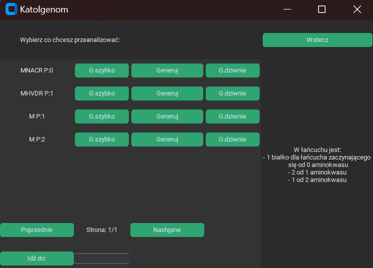
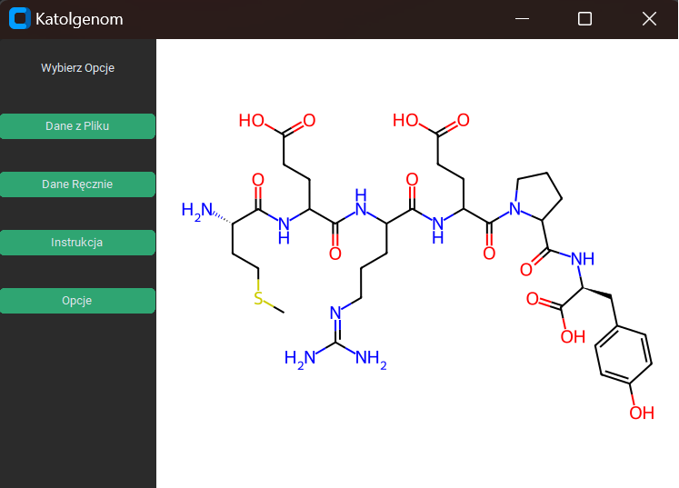

# Katolgenom Program Guide
## **What is KatolGenom?**
KatolGenom is tool, for extracting posible proteins recipes from RNA or DNA chain. In our tool you can find possible proteins and see their chemical features. Project was writen for hackathon (Motorolla Science Cup 2023, project finished in 1st place) in Polish, so unluckly content is in Polish.
Welcome to Katolgenom! This guide will help you navigate through the program features efficiently. Let's dive into the details of each screen.

---

## **Screen 1: Main Interface**

The starting point of the Katolgenom program. You can access various functionalities via four buttons:
- **File Input**
- **Manual Input**
- **Instruction**
- **Options**

### **Features**
1. **File Input**
    - Upload protein data from a local file:
      1. Click the **"Browse"** button.
      2. A file selection dialog will appear.
      3. Locate your desired file and click **"Open"** to import it.

2. **Manual Input**
    - Enter protein codons manually:
      - Use the field labeled **"Enter the RNA or DNA strand code"** to type the codon sequence.

3. **Instruction**
    - Opens the program's guide (this document) for detailed help and instructions.

4. **Options**
    - Navigate to customization settings (see Screen 2 for more details).

---

## **Screen 2: Options**

The **Options** screen provides settings to personalize the interface and program behavior.

### **Customization Options**
- **Background Color**  
  Switch between a dark theme or a light theme for the interface.

- **Button Colors**  
  Customize button appearances by choosing one of the following:
  - Blue
  - Dark Blue
  - Green

- **Highlight Main Chain**  
  Highlight the primary protein chain visualization with red in all display modes:
  - Quick
  - Standard
  - Split

- **Back**  
  Return to the main interface.

---

Happy exploring and customizing your Katolgenom experience!
